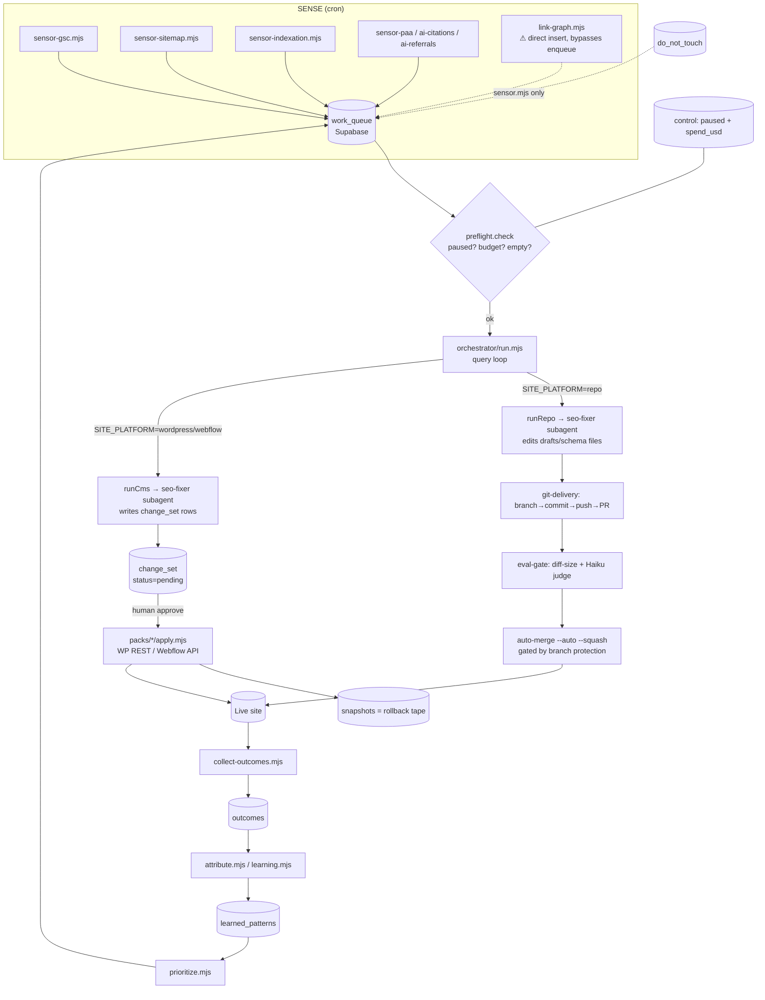

# Repository Audit — maxx-seo-agent

> **POINT-IN-TIME ENGINEERING AUDIT · 2026-06-30 · HEAD `9e6c2a3`.**
> Read-only review of the *agent runtime* (not the maxxbuilders.com site it optimizes). Method:
> evidence-first reading of every load-bearing module by the auditor, plus a 22-agent
> fan-out that gathered findings across 9 domains and an adversarial verifier that tried to
> *refute* every HIGH/CRITICAL claim. Verdicts (`CONFIRMED` / `PLAUSIBLE` / `REFUTED`) and
> corrected severities are recorded inline. Nothing in this file changes runtime behavior.

## How to read this

- **Verified finding** = a defect with an exact `file:line` and a quote/value proving it, that survived adversarial verification.
- **Assumption** = stated explicitly and flagged; not treated as fact.
- Confidence is 0–100. Below 80, the missing evidence is named.
- Severity bar: **critical** = data loss / security breach / silent corruption / money runaway; **high** = likely failure or real security/maintainability risk; **medium** = robustness/quality; **low/info** = polish.

### Corrections made during verification (rigor log)
1. **No Node-version mismatch exists.** package.json, both CLAUDE.md files, `technical-defaults.md`, and all CI workflows say `>=22`/`node-version: 22` consistently. My initial hypothesis of a `>=20` vs `>=22` split came from a **stale cached copy** of `.claude/CLAUDE.md` in the session context, not the on-disk file. *Not a finding.*
2. **README stub downgraded HIGH→LOW.** The repo's primary consumers (the headless orchestrator + interactive Claude Code sessions) auto-load context via `settingSources:["project"]`; only a human browsing GitHub is left unoriented. Real, but polish.
3. **Spend-counter race downgraded HIGH→MEDIUM.** Bounded and self-correcting (loses ~one run's cost per rare collision), narrow window, requires a local run overlapping the nightly CI run.
4. **guard-publish mechanics corrected.** The over-broad `301` match and the base64-pipe bypass are *empirically confirmed*; but `git push origin HEAD:refs/heads/main` and spaced `wp  post  delete` **are** caught — those two evasion examples were refuted.

---

# PHASE 1 — Repository Discovery

**Project purpose.** A closed-loop, autonomous SEO improvement runtime: sensors detect opportunities → an Agent-SDK orchestrator plans/dispatches subagents → changes are delivered as PRs (repo mode) or `change_set` rows (CMS mode) → a human merges/approves → outcomes feed back into prioritization. Evidence: `.claude/CLAUDE.md`, `orchestrator/run.mjs:1-7`, `CONTEXT.md`.

**Business domain.** B2B SEO for Maxx Builders (Texas commercial general contractor). The *target site* is a separate WordPress deployment; **this repo is the agent, not the site**.

**Primary users.** (a) The autonomous CI loop (GitHub Actions cron), (b) interactive Claude Code / Codex sessions, (c) a non-engineer operator (Harris) via `OPERATIONS.md` + Supabase.

**Architecture style.** Event/cron-driven pipeline with a shared persistence "memory layer," thin platform-adapter packs, and a pure-core + injectable-I/O testing seam. Not a service; a batch/automation runtime.

**Repository structure (173 tracked files).** `orchestrator/` (entry + lib), `scripts/` (sensors, validators, attribution, one-offs), `packs/` (WordPress + Webflow apply), `lib/` (a *second* AI-search DB layer — see findings), `.claude/` (skills, agents, hooks, rules, settings), `sql/` (2 schema files), `drafts/`/`schema/`/`change_set/`/`output/`/`audit/` (artifacts), plus ~13 root-level `.md` docs and `docs/adr/`.

| Aspect | Finding | Evidence |
|---|---|---|
| Language | JavaScript, ESM only (`.mjs`) | `package.json:5` `"type":"module"`; 54 `.mjs` files |
| Runtime | Node `>=22` (consistent everywhere) | `package.json:6`; `seo-sensors.yml:23` `node-version: 22` |
| Build system | **None** — raw `node --env-file=.env <file>.mjs` | `package.json:7-26`; no tsconfig/bundler |
| Package mgmt | npm, committed lockfile v3 (integrity hashes), CI uses `npm ci` | `package-lock.json`; `test.yml:18-20` |
| Direct deps | 5, all imported: agent-sdk, supabase-js, google-auth-library, googleapis, marked | `package.json:27-33` |
| Test framework | Node built-in `node --test` (no Jest/Vitest, **zero devDeps**) | `package.json:8`; AGENTS.md:33 |
| Orchestration | `@anthropic-ai/claude-agent-sdk` `query()` loop | `orchestrator/run.mjs:8,24` |
| Memory | Supabase Postgres (9 core tables + AI-search tables) | `sql/schema.sql`, `sql/ai-search-schema.sql` |
| Deploy model | No app deploy; the artifact IS the running CI pipeline | 8 workflows in `.github/workflows/` |
| CI/CD | 8 GitHub Actions workflows (sensors, eval-gate, auto-merge, learn, apply-cms, ai-search-sensors, vitals-pr, test) | `.github/workflows/` |

**Phase 1 summary.** A deliberately minimal, build-free, ESM Node runtime with a tiny fully-utilized dependency surface and a reproducible `npm ci` install. Mental model is clear and well-documented in `.claude/CLAUDE.md`/`CONTEXT.md`.
**Remaining uncertainty:** runtime values of GitHub `vars` (`SITE_PLATFORM`, `MONTHLY_BUDGET_USD`, `MAX_DIFF_LINES`, `JUDGE_MIN_SCORE`) and whether `setup-branch-protection.sh` was actually applied — both unknowable from the repo and both safety-relevant.
**Confidence: 93%.**

---

# PHASE 2 — Architecture Understanding

**Layers & boundaries.** (1) *Sensing* (`scripts/sensor-*`, `orchestrator/lib/sensor.mjs`, `gsc.mjs`) → write queue. (2) *Memory* (`orchestrator/lib/supabase.mjs` over a private `client.mjs`) — the documented single persistence seam. (3) *Orchestration* (`run.mjs` + `goal.mjs` + `preflight.mjs`). (4) *Delivery* — repo (`git-delivery.mjs`) or CMS (`cms.mjs` + `packs/*`). (5) *Learning* (`learning.mjs` pure cores + `attribute.mjs`/`prioritize.mjs` I/O).

**Strengths (verified).**
- **Persistence seam is real:** the service-role client is private to `client.mjs` and reached only via named helpers (`supabase.mjs`); enforced by docs + comments.
- **Pure/injectable cores for the riskiest logic:** `learning.mjs` (`effectOf`, `priorityScore`, `attribute`, `reprioritize`), `cms.mjs` (`applyRow`), `gsc.mjs` (retry/pagination) are testable without a DB/network — and *are* tested.
- **Deliberate failure-path separation** in `run.mjs:45-64`: agent failure → hard-reset rollback + discard spend; delivery failure → keep committed work for retry. Intentional and commented.
- **Canonical vocabulary contract:** `tasks.mjs` `KIT_TASKS` is the shared string space for `work_queue.task` / `change_set.change_type` / `learned_patterns.change_type`, with a write-boundary guard (`assertTaskType`) and a documented join-key rationale.

**Weaknesses (verified — detailed in Phase 11).**
- **Two subsystems don't reconcile.** A bolted-on "AI-search/GEO" module (`lib/db.mjs`, `lib/engines.mjs`, `scripts/sensor-ai-*`, `link-graph.mjs`, `sql/ai-search-schema.sql`) runs its **own** Supabase client and its **own** attribution writer, and several cross-subsystem contracts are broken (see A1, A2 below).
- `link-graph.mjs` enqueues task `internal-link-graph`, which **is not in `KIT_TASKS`** (the canonical value is `internal-linking`) → the orphan-fix path throws at the write boundary or silently drops from attribution. **CONFIRMED, HIGH** (`link-graph.mjs:83` vs `tasks.mjs:17`).
- **Two weekly jobs clobber `learned_patterns`.** `attribute.mjs` writes a *normalized lift fraction*; `attribute-citations.mjs` writes a *raw citation-count delta* — both `upsert(... onConflict:"change_type")` into a table with **no metric column**. `seo-learn` (Mon 08:00) runs 90 min after `ai-search-sensors` (Mon 06:30) and overwrites the citation signal every week. **CONFIRMED, HIGH.**
- Schema split across two files with no link; `CLAUDE.md` says "9-table schema" and points only at `schema.sql`, but `link-graph`/AI-search sensors target tables only `ai-search-schema.sql` creates → runtime PostgREST errors on a partially-migrated DB. **MEDIUM.**

**Critical paths.** Nightly: `seo-sensors.yml` → sensors → `run.mjs` → (repo) PR+eval-gate+auto-merge, or (CMS) `change_set`. Weekly: `seo-learn` attribution → prioritize. The **money/safety control path** is `preflight.check` (paused/budget/queue) + `guard-publish.sh`.

**Phase 2 summary.** The *core* runtime is well-architected with genuine seams; the *AI-search* addition is an under-integrated second subsystem whose contracts with the core (task vocabulary, `learned_patterns` table, schema, DB client) are broken in four places.
**Confidence: 88%** (lower on live cron overlap / which subsystem actually runs in prod, unknowable from repo).

---

# PHASE 3 — Context Quality

**Strengths.** `AGENTS.md` is exemplary (scoped to non-discoverable landmines, names the 3-file source-of-truth chain). `CONTEXT.md` is a model glossary (per-table schemas, status enums, both publishing loops, a "terms NOT used" anti-synonym table). The six real ADRs are well-structured. `OPERATIONS.md` is a genuinely usable non-engineer runbook. The layered CLAUDE.md design (root = SEO truth, `.claude/` = repo mechanics, `.claude/rules/*` = detail) is sound.

**Defects (verified).**

| # | Severity | Finding | Evidence |
|---|---|---|---|
| C1 | **HIGH** (conf 98, CONFIRMED) | `CONTEXT.md` + buzz doc link to **phantom ADRs** `0001/0002/0003` (repo-per-client, human-gate-policy, single-configurable-skill) that don't exist; real files are `ADR-001..006` on different topics. 9 broken governance references total. | `CONTEXT.md:209-211`, `:173,187`; buzz doc `:18,100,106,240,301-302`; `ls docs/adr/0001*`→none |
| C2 | MEDIUM | Roadmap/setup docs (`AGENTIC-ROADMAP`, `AGENTIC-SETUP`) describe an **unbuilt "scaffold" that already shipped**, no superseded banner; instruct copying from a nonexistent `core/CLAUDE.md` layout. | `AGENTIC-SETUP.md:5,319`; runtime files present |
| C3 | MEDIUM | Three **site-audit artifacts** (`ACTION-PLAN.md`, `FULL-AUDIT-REPORT.md`, `seo-audit.md`, ~1200 lines) sit at repo root as undated-looking snapshots of the *external site*, mixable with runtime docs. | `FULL-AUDIT-REPORT.md:1-2`; `ACTION-PLAN.md:2-4` (42/100) |
| C4 | LOW | **Skill count rot:** docs say "11 skills"; 16 dirs exist; `KIT_TASKS` lists 13. Triple inconsistency. | `.claude/CLAUDE.md:31`; `ls .claude/skills/*/`=16; `tasks.mjs:10-24`=13 |
| C5 | LOW | **README is a 16-byte stub** (`# maxx-seo-agent`), no doc index. *(Downgraded from HIGH: orchestrator + interactive sessions self-orient via `settingSources`; only a GitHub-browsing human is affected.)* | `README.md:1`; `git log -1 -- README.md`=Initial commit |

**Phase 3 summary.** *Over-documented in volume, under-indexed for onboarding.* The canonical core (AGENTS.md/CONTEXT.md/CLAUDE.md/rules) is excellent; surrounded by ~3,000 lines of overlapping point-in-time/aspirational docs with no map, and the canonical glossary cites dead ADR links. **Confidence: 90%.**

---

# PHASE 4 — Code Quality

**Strengths (verified).** `cms.mjs` is a textbook deep module — one apply lifecycle, thin per-platform adapters, so **the WordPress/Webflow packs are NOT duplicated** (they share `applyRow`/`rollbackRow`, supplying only I/O). Consistent ESM `main().catch(e=>{console.error(e);process.exit(1)})` entrypoint convention; no silently-swallowed errors in runtime code. `scripts/lib/csv.mjs` is a correct single-pass RFC-4180 parser with regression tests. All non-test files are well under the 800-line guideline (largest ~269 lines).

**Verified findings (ranked).**

| # | Severity | Finding | Evidence | Verdict |
|---|---|---|---|---|
| Q1 | **HIGH** (conf 95) | **`scripts/check-vitals.sh` referenced by 6 callers but never committed.** `publish.mjs` execs it post-publish inside a *bare* catch → always misreports ENOENT as "CANARY FAIL: regressed CWV"; `vitals-pr.yml` + `seo-apply-cms.yml` chmod+run a nonexistent file. | `publish.mjs:67-70`; `git log --all -- scripts/check-vitals.sh`=empty; `vitals-pr.yml:25-26`, `seo-apply-cms.yml:58` | CONFIRMED |
| Q2 | **HIGH** (conf 82) | **3 tracked one-off scripts insert `status='approved'` `change_set` rows**, and `cms.applyRow` never re-checks `do_not_touch` (only `sensor.mjs` does) → `npm run wp:apply` can overwrite a human-protected URL. `base_value:null` also defeats the drift gate. | `run_all_blog_changesets.mjs:60`, `import-metadata-csv.mjs:93`, `fix-base-values.mjs:38`; `cms.mjs:64-92` (no `doNotTouch`) | CONFIRMED (count corrected 6→3; `fix-base-values.mjs` remediated 2026-07-04 (Panel-A A6) — it no longer writes `status` and refreshes `base_value` only on already-approved rows via a conditional write → **2 writers remain**) |
| Q3 | MEDIUM | **The CSV bug `csv.mjs` was created to fix still lives in `collect-outcomes.mjs`** — it still `split("\n")`/`split(",")` on `CITATIONS_CSV`/`CONVERSIONS_CSV`, poisoning `outcomes`→`learned_patterns`. | `collect-outcomes.mjs:18-21`; `csv.mjs:3-8` | — |
| Q4 | MEDIUM | **Three competing markdown→HTML implementations** for the same `drafts/*.md`: hand-rolled `markdownToHtml` in `publish-drafts.mjs` vs `marked` in two scripts → same draft renders differently by path. | `publish-drafts.mjs:117-169`; `create_design_build_post.mjs:16`; `run_all_blog_changesets.mjs:50` | — |
| Q5 | LOW | `publish-drafts.mjs` carries a ~25-line **unreachable UPDATE path** (create-only `continue` guarantees the next `if(existingId)` block never runs); enabling it is a "delete this block" instruction, not a flag. | `publish-drafts.mjs:225-250` | — |
| Q6 | LOW | **Hardcoded WP post ID `7429`** in tracked `publish_design_build.mjs` — a runnable one-off that POSTs `status:publish` to a magic ID. | `publish_design_build.mjs:3` | — |
| Q7 | INFO | Stale comment in `keyword-research.mjs` (documents Semrush short-codes `Ph/Nq/Kd/Td`; code reads human-readable column names). | `keyword-research.mjs:62` vs `:67-70` | — |

**Cross-cutting:** the repo's biggest quality liability is the **tracked one-off/scratch script cluster** (`create_design_build_post`, `publish_design_build`, `fix_draft_headings`, `fix-base-values`, `run_all_blog_changesets`, `import-metadata-csv`, `scripts/adhoc/*`). AGENTS.md:26-27 *warns* scratch isn't canonical, yet these are committed and several bypass the core's guards (Q2) or use the raw `lib/db.mjs` client for inline `change_set` writes.

**Phase 4 summary.** Runtime core is clean and disciplined; the edges (one-off scripts, a missing shell script, a re-introduced parser bug, divergent md→HTML) carry the debt. **Confidence: 88%.**

---

# PHASE 5 — Security Review

**Strengths (verified).** `.env`/`gcp.json` gitignored *and* confirmed untracked; CI passes secrets via Actions secret blocks; `gcp.json` written from secret then removed (`if: always()`). Service-role key isolated to `client.mjs` (`persistSession:false`, server-only). GSC OAuth scoped `webmasters.readonly`. WP PHP bridge gates every meta key behind `current_user_can('edit_posts')`; apply pack documented to use an Editor (not Admin) role. No raw credential logging. Supabase access is fully parameterized (no SQLi). `eval-judge` fails closed.

**Verified findings.**

| # | Severity | Finding | Evidence | Verdict |
|---|---|---|---|---|
| **S1** | **CRITICAL** (conf 82) | **Command injection via agent-built Bash strings.** The CMS goal prompt instructs the LLM agent to itself build & run `node scripts/mem.mjs changeset --base "<current>" --new "<generated>"` where `<current>` is the live (third-party-editable) CMS field value and `<generated>`/`post_content` is full LLM HTML. No shell-escaping helper exists; naive `"`-wrapping breaks on `"`, `$(...)`, backticks. Agent + subagent both have `Bash` + `permissionMode:"acceptEdits"`; runs unattended in the nightly `seo-sensors` job alongside `SUPABASE_SERVICE_ROLE_KEY`, `ANTHROPIC_API_KEY`, write-scoped `GH_TOKEN`. | `goal.mjs:36`; `run.mjs:75-76,86,93,97`; `mem.mjs:11-18` (parses argv safely — breakout is at the *shell* layer); no escape helper in repo; `seo-sensors.yml:48-56` | **CONFIRMED** — RCE driven by data the SEO target controls. Fires only when `SITE_PLATFORM∈{wordpress,webflow}` so `runCms` executes (root CLAUDE.md says platform = WordPress). |
| **S2** | **HIGH** (conf 78) | **`guard-publish.sh` is the *sole* Bash guardrail and is over-broad + bypassable.** Empirically: bare `301` (no boundary) denies any payload containing "301" (false-blocks legit work — it even fired on the verifier's own session); `printf <b64> \| base64 -d \| bash` of `wp post delete 5` is **ALLOWED**. A denylist structurally can't enumerate dangerous commands and can't see S1's data-borne payload. *(Corrected: `git push origin HEAD:refs/heads/main` and spaced `wp  post  delete` ARE caught.)* | `guard-publish.sh:10,12,14`; `settings.json:7-13` (only PreToolUse Bash hook) | **PLAUSIBLE** (core thesis confirmed; 2 evasion examples refuted) |
| S3 | MEDIUM | `git-delivery.mjs` interpolates `${branch}`/`${message}`/`${label}` into `execSync` (shell). Not injectable *today* (message static, branch timestamped) but one parameterization away from injection. | `git-delivery.mjs:6,32,34` | — |
| S4 | MEDIUM | `post-validate.sh` interpolates a payload-derived `$file` into a shell-evaluated `node -e "...readFileSync('$file')..."` → a crafted path executes code on the validate hook. | `post-validate.sh:7,13` | — |
| S5 | MEDIUM | **Service-role key has full prod read/write incl. `control` (kill switch) and `do_not_touch`**, shared across all autonomous jobs; no read-only path for sensors. An S1 compromise can disable its own guardrails. | `client.mjs:8`; `security.md` credential table; `seo-apply-cms.yml:33` | — |
| S6 | LOW | **SSRF:** `sensor-sitemap.mjs` recursively fetches child `<loc>` URLs from the sitemap with no host/scheme allowlist (could be steered at `169.254.169.254` in CI). Bounded: response is only regex-scanned, one recursion level. | `sensor-sitemap.mjs:20,23` | — |

**Overall security maturity: 5 / 10.** Credential hygiene, key isolation, least-privilege at the WP layer, and a fail-closed judge are genuinely good (would be 7–8). But the autonomous path has an **RCE-class injection (S1)** whose only deterministic backstop is a **bypassable denylist (S2)**, on top of a **single over-privileged key that can rewrite its own safety tables (S5)**. For an *unattended* agent with `Bash`, the right model is an allowlist, not a denylist — its absence caps the score.

**Phase 5 summary.** One critical, one high, three medium, one low. The dominant theme: untrusted/LLM-derived content reaching a shell on an autonomous, credential-bearing path. **Confidence: 84%** (S1 exploitability also depends on the SDK routing the LLM string through a real shell — well-established but not exercised here, and on the runtime `SITE_PLATFORM` value).

---

# PHASE 6 — Performance Review

This is a **cron/batch** system (queue limit 25, weekly learn job), so latency is mostly irrelevant; the real risks are *correctness-under-concurrency* and *unbounded scans*.

| # | Severity | Finding | Evidence | Verdict |
|---|---|---|---|---|
| P1 | **MEDIUM** (conf 80) | **Spend-counter lost-update race.** `addSpend` = read `getMonthSpend` then plain `UPDATE spend_usd=current+usd` (no atomic increment/lock/CAS) on single-row `control`. CI concurrency group serializes *CI* runs only; a local `npm run orchestrate` hitting the same prod row is invisible to it. *(Downgraded from HIGH: window is a ~few-ms 2-round-trip span after a multi-minute loop; loss is ~one run's cost per collision, self-correcting.)* | `supabase.mjs:30-35`; `schema.sql:62-69` (no version col); `seo-sensors.yml:11-13` | **PLAUSIBLE→MEDIUM** |
| P2 | MEDIUM (conf 90) | **Attribution N+1:** `attribute()` runs 6 Supabase round-trips per applied decision (`clicks/position/impressions Around` × before+after), over an **unbounded** `appliedDecisions(120)` set (no `.limit()`). Fine at current scale; grows linearly. | `learning.mjs:47-51`; `supabase.mjs:108-114,116-125` | — |
| P3 | LOW | WordPress apply does **2 redundant full-post GETs** per row (read + verify both `GET ?context=edit`). Bounded by 200-row `change_set` cap. | `apply.mjs:37,44-48`; `cms.mjs:72-82` | — |
| P4 | LOW | `runCms` has **two `addSpend` call sites** (normal completion + the "exited with code 1" catch) → possible double-count of one run's cost (errs safe — over-counts). | `run.mjs:106,111-114` | — |

**Strengths.** `gsc.mjs` does correct cursor pagination + exponential backoff (won't truncate above 5000-row pages). Sensors are quota-capped where it bites (indexation 50/run; link-graph 150 pages). `csv.mjs` is O(n).

**Phase 6 summary.** No latency hotspots; the meaningful issues are the (bounded) spend race and a linearly-growing attribution N+1 — both one-query/RPC fixes that preserve the injectable-core design. **Confidence: 86%.**

---

# PHASE 7 — Testing

**Inventory:** Node `node --test`, **8 files / ~87 tests, all green, fully hermetic** (mocked `global.fetch`, injected stores/clients, dummy env, restored in `finally`). Coverage concentrates on the extracted pure seams: `cms.applyRow` (`apply.test`), `gsc.mjs` retry/paging (`gsc.test`), `learning.mjs` scoring + `attribute`/`reprioritize` (`learning.test`), `csv.mjs` (`csv.test`), `eval-judge` pure pieces (`eval-judge.test`), `tasks.mjs` guard, `push-escalations`, sensor URL hygiene (`sensors.test`). Mocks assert real wire shapes; regression tests cite real past incidents.

**Verified gaps (ranked).**

| # | Severity | Untested path | Why it's dangerous | Verdict |
|---|---|---|---|---|
| T1 | **HIGH** (conf 93) | **`git-delivery.mjs`** (`rollback`/`openPR`/`startBranch`) — runs `git reset --hard` + `git branch -D` on the orchestrator failure path; no test, no injectable seam (`execSync` at module top). | The single most destructive untested path; a regression (or detached-HEAD `git checkout -` in Actions) silently destroys work, invisible to CI. | CONFIRMED |
| T2 | **HIGH** (conf 82) | **`preflight.mjs`** budget/pause/queue gate — the designated runaway-spend + kill-switch defense, untested. *(Corrected: it IS testable via the repo's own env-shim/DI pattern — "no seam" overstated; gate is currently correct, risk is a future regression.)* | An inverted `>=`/ordering ships green and drains the metered API pool. | CONFIRMED |
| T3 | MEDIUM | `validate-metadata-csv.mjs` + `check-diff-size.mjs` — the deterministic halves of the eval-gate (60/155 char + diff-line thresholds). | A boundary regression lets non-compliant metadata through or wedges every PR. | — |
| T4 | MEDIUM | Webflow **global-publish guard** (`publish.mjs`: `WEBFLOW_ALLOW_SITE_PUBLISH` refusal, all-CMS-vs-page decision, 100-item chunking). | An untested guard on an irreversible global site flush. | — |
| T5 | MEDIUM | `run.mjs` control flow (rollback-vs-preserve, "exited with code 1"=success heuristic, repo/CMS branch). | An SDK shutdown-string change silently converts failure→success. | — |
| T6 | LOW | `supabase.mjs` query builders (`pendingQueue` order/limit, `metricAround` windowing, `escalatedQueue` throw). | A filter/order refactor returns wrong-but-non-erroring rows, skewing attribution. | — |

**Can it be safely refactored?** *Yes within the tested pure cores* (learning, cms, gsc, csv). *No* in the `git-delivery`/`preflight`/`run.mjs`/`supabase` persistence & control layer — a regression there is invisible and, for `git-delivery`, irreversible.

**Phase 7 summary.** Seam-first testing is genuinely good where it exists; the gap is exactly the safety-critical I/O boundary (destructive git ops + the money/kill-switch gate). **Confidence: 90%.**

---

# PHASE 8 — DevOps

*(The dedicated CI/CD evidence agent failed to return structured output; this phase is authored from the auditor's firsthand reading of all 8 workflows + both hooks + `settings.json`.)*

**CI/CD topology.**

| Workflow | Trigger | Does | Notes |
|---|---|---|---|
| `seo-sensors.yml` | cron `0 7 * * *` + dispatch | sensors → `run.mjs` | `concurrency: seo-sensors`; writes/removes `gcp.json` |
| `ai-search-sensors.yml` | cron `30 6 * * 1` | AI-search sensors + `attribute-citations` | clobbers `learned_patterns` (A2) |
| `seo-learn.yml` | cron `0 8 * * 1` | `attribute` → `prioritize` | 90 min after ai-search-sensors |
| `seo-eval-gate.yml` | `pull_request` | diff-size + Haiku judge (seo-auto only) | fail-closed; human PRs skip |
| `seo-auto-merge.yml` | `pull_request` | `gh pr merge --auto --squash` (seo-auto only) | **relies on branch protection** |
| `seo-apply-cms.yml` | (apply) | packs apply + `check-vitals.sh` | refs missing script (Q1) |
| `vitals-pr.yml` | `deployment_status` | CWV canary via `check-vitals.sh` | refs missing script (Q1) |
| `test.yml` | PR/push | `npm ci` + `npm test` | node 22 |

**Build reproducibility:** strong — `npm ci` + lockfile v3 + pinned node 22, no build step. **Rollback:** git (`rollback()`), packs `rollback.mjs`, `snapshots` table for CMS. **Secrets:** Actions secrets, ephemeral `gcp.json`.

**Verified DevOps risks.**
- **D1 (HIGH, ties to AH2): `[skip ci]` in content PRs.** `run.mjs:55` hardcodes `[skip ci]` into every repo-mode PR commit, contradicting `workflow.md:54-55` ("content changes should not carry `[skip ci]` so the eval-gate runs"). Since auto-merge is *also* `on: pull_request`, the dominant outcome is a **dead-locked PR** (required eval-gate check never reports, neither auto-merge nor human can merge); if branch protection is absent, unjudged content merges. *(Corrected: `vitals-pr.yml` is `deployment_status`-triggered, NOT skipped.)* **CONFIRMED, conf 85.**
- **D2 (HIGH config-SPOF):** the entire auto-merge safety model depends on `setup-branch-protection.sh` having been run so the eval-gate is a *required strict* check. Unverifiable from the repo; if not applied, `--auto` may merge with no gate.
- **Observability ≈ absent (MEDIUM):** the only signals are `console.log`, GitHub Actions logs, a local-only append-only `.claude/seo-audit.log`, and `decision_log`. **No metrics, tracing, dashboards, or proactive alerting** on a failed nightly/weekly cron. An operator learns of breakage from the Monday `OPERATIONS.md` checklist, not a page.

**Phase 8 summary.** Reproducible, well-isolated CI with thoughtful rollback layers, undermined by (a) a self-inflicted `[skip ci]` that can dead-lock delivery, (b) a config single-point-of-failure (branch protection), (c) a broken CWV canary, and (d) effectively no runtime observability/alerting. **Confidence: 82%** (lower because the dedicated agent failed and `vars` values are unknown).

---

# PHASE 9 — AI Harness Engineering

This repo *is* an AI harness, and a mature one. Per-capability maturity (1–10):

| # | Capability | Score | Justification |
|---|---|---|---|
| 1 | Instructions / rules | **9** | Clean layered separation (root CLAUDE.md=SEO truth, `.claude/CLAUDE.md`=mechanics, `.claude/rules/*`=risk/creds/defaults, AGENTS.md=landmines); files cross-reference each other. |
| 2 | Context delivery | **8** | `CONTEXT.md` glossary + table schemas + anti-synonym table; ADRs; skill files. Dinged by C1 phantom-ADR dead links. |
| 3 | Context management | **5** | Root crowded with ~20 overlapping/aspirational docs + a stub README + 12 on-disk worktree `CONTEXT.md` copies; no index. An exploring agent can anchor on stale roadmaps. |
| 4 | Tool interfaces | **8** | `mem.mjs` Bash-callable memory CLI (avoids MCP friction headless) + clean `npm run *` aliases — the right affordances. Dinged by `/wp-apply`-style handoffs that aren't real skills. |
| 5 | Execution environment | **6** | Reproducible (`npm ci`, pinned node), but **no sandboxing** of the autonomous `Bash` agent (S1/S2), and setup docs point at a nonexistent `core/` layout. |
| 6 | Durable state | **7** | 6 real ADRs + `decision_log` + `learned_patterns` + `snapshots`. Dinged by phantom-ADR references and unbuilt-vs-shipped roadmap ambiguity. |
| 7 | Orchestration | **8** | Genuine closed loop with risk-class gating, fail-closed judge, change_set human gate, PR autonomy. Dinged by D1/AH2 `[skip ci]`. |
| 8 | Skills | **6** | 16 skills, but `KIT_TASKS` drift (3 skills uncatalogued), miscounted in docs (11), and handoff commands that don't exist. |
| 9 | Verification | **7** | eval-gate (diff-size + Haiku, fail-closed) + JSON-LD/metadata validators + deterministic hooks. Dinged because the gates themselves (preflight/diff-size/metadata/mem.mjs) are largely untested. |
| 10 | Observability | **7**→ realistically **4–5** for *runtime* ops | Good *decision* audit trail (`decision_log`), but no operational metrics/alerting on cron health (see Phase 8). The agent's self-narration is fine; the operator's visibility is thin. |

**Harness-specific verified findings.**
- **AH1 (HIGH, conf 93, CONFIRMED): `do_not_touch` agent-side check queries the wrong table.** Both `seo-fixer` definitions tell the agent to "check `do_not_touch` via `node scripts/mem.mjs queue`" — but `mem.mjs queue` reads `work_queue`, not `do_not_touch`; `mem.mjs` has no command that reads `do_not_touch` at all. In CMS mode this is the seo-fixer's *only* `do_not_touch` guard (mitigated downstream by the `pending`→human-approval gate). `.claude/agents/seo-fixer.md:32`, `mem.mjs:20-21`, `supabase.mjs:37,60-65`. Same defect in `.codex` copy.
- **AH2 (HIGH, conf 85, CONFIRMED): `[skip ci]` content PRs** — see D1.
- **AH3 (MEDIUM): parallel `.codex` harness has drifted** — wrong skill-path casing (`.Codex/skills` vs `.agents/skills/`, case-sensitive on Linux), points agents at `AGENTS.md` for SEO thresholds that live in root CLAUDE.md, inherits AH1. `.codex/agents/seo-fixer.toml:18-21`.
- **AH4 (LOW): skill handoff commands `/wp-apply` `/webflow-apply` `/metadata-fix` don't exist** as skills (apply is via `npm run`; skill is `metadata-generate`). `metadata-generate/SKILL.md:22-23` etc.
- **AH5 (MEDIUM): context noise** — 20 root docs + stub README + 12 worktree dirs dilute discovery (= C1–C5).

**Phase 9 summary.** A genuinely above-average harness (instructions, vocabulary, orchestration, affordances) with harness-specific drift: a no-op safety check (AH1), a self-defeating CI token (AH2), a stale second harness (AH3), and context-management noise. **Confidence: 88%.**

---

# PHASE 10 — Risk Analysis

| ID | Risk | Likelihood | Impact | Priority |
|---|---|---|---|---|
| R1 | **RCE via LLM/CMS-derived content in agent-built Bash (S1)** on the unattended, service-role-bearing path | Medium (needs CMS mode + a `"`/`$()` in content) | Critical (RCE + DB/key exfil) | **P0** |
| R2 | **Delivery dead-lock / unjudged merge from `[skip ci]` (D1/AH2)** | High (every repo-mode PR) | High (pipeline stalls or gate bypassed) | **P0** |
| R3 | **Branch-protection config SPOF (D2)** — auto-merge safety depends on an out-of-band script having run | Unknown | High (auto-merge with no gate) | **P1** |
| R4 | **`learned_patterns` clobber (A2)** corrupts prioritization weekly; **`internal-link-graph` vocab break (A1)** kills a skill's loop | High (every Mon / every link-graph run) | Medium-High (silent signal corruption) | **P1** |
| R5 | **`do_not_touch` agent guard is a no-op (AH1)** + apply layer never re-checks it (Q2) | Medium (operator adds URL post-enqueue, or runs a one-off + wp:apply) | High (protected page overwritten live) | **P1** |
| R6 | **Untested destructive git rollback (T1)** + untested money/kill-switch gate (T2) | Low-Medium (on refactor/SDK change) | High (work loss / budget overrun) | **P1** |
| R7 | **Missing `check-vitals.sh` (Q1)** — false CWV-regression alarms + failing CI step | High (whenever publish/vitals path runs) | Medium (false rollbacks, distrust) | **P2** |
| R8 | **Service-role over-privilege (S5)** — one compromise rewrites its own kill switch | Low | Critical | **P2** |
| R9 | **Spend lost-update (P1)** | Low | Low-Medium (bounded overrun) | **P3** |
| R10 | **Doc rot / phantom ADRs (C1) + onboarding map absent** | High (every new engineer/agent) | Medium (wrong mental model) | **P2** |
| R11 | **Pre-1.0 SDK `^0.1.0` drift; `@latest` write-enabled MCP; undeclared `zod` peer** | Medium | Medium (loop breaks on bump) | **P2** |

**Single points of failure:** the single service-role key (S5/S8), branch-protection config (R3), and the orchestrator's `git reset --hard` rollback (T1). **Knowledge/people risk:** heavy reliance on undocumented runtime `vars` and an out-of-band branch-protection step; a single maintainer (Harris). **Confidence: 87%.**

---

# PHASE 11 — Recommendations

### CRITICAL

**REC-1 — Eliminate command injection on the autonomous path (S1).**
- **Problem/Root cause:** the goal prompt makes the LLM assemble shell strings from untrusted CMS values + LLM HTML; no escaping; `Bash`+`acceptEdits` unattended.
- **Evidence/Files:** `orchestrator/goal.mjs:36`, `orchestrator/run.mjs:93`, `scripts/mem.mjs`. **Impact:** RCE + service-role/API-key exfil on `seo-sensors` cron.
- **Steps:** (1) Stop templating values into Bash — have `mem.mjs changeset` read `--new`/`--base` from **stdin or a temp JSON file**, or spawn via `execFile`/`spawn` with an args array (no shell). (2) Rewrite the goal prompt to call a single deterministic wrapper, not a templated command. (3) Defense-in-depth: replace `guard-publish.sh` denylist with an **allowlist** of permitted commands (REC-2). 
- **Effort:** L · **Confidence:** 82% · **Verification:** add a test feeding `"; touch PWNED; "` as `base_value` and assert no shell execution + the value persisted intact. **Success metric:** zero shell-metacharacter breakouts; canary payload stored verbatim. **Trade-off:** the prompt becomes less "natural"; **Prereq:** confirm runtime `SITE_PLATFORM`.

**REC-2 — Replace the Bash denylist with an allowlist (S2).**
- **Evidence/Files:** `.claude/hooks/guard-publish.sh:10-14`, `.claude/settings.json`. **Impact:** the autonomous agent's last deterministic line of defense currently both false-blocks (`301`) and is base64-bypassable.
- **Steps:** parse the tool-input JSON `command` field; allow only `node scripts/mem.mjs …`, the named validators, `git add/commit/checkout -b/push <seo branch>`, `gh pr create`; deny all else. Remove the bare `301` match (scope to redirect emission). **Effort:** M · **Confidence:** 85% · **Verification:** re-run the 13-payload test set — base64-pipe-to-bash now DENIED, `cat report-301.md` now ALLOWED. **Success metric:** 0 false denials, 0 known bypasses. **Trade-off:** must enumerate legitimate commands (maintenance cost).

### HIGH

**REC-3 — Drop `[skip ci]` from content PRs (D1/AH2).** Change `run.mjs:55` so content commits don't carry `[skip ci]`; branch the token only for genuine non-content chores. **Verify** the eval-gate context is `required` in branch protection so a skipped run can't pass. Effort S · Conf 85% · Success: every `seo-auto` PR triggers eval-gate; no dead-locked PRs.

**REC-4 — Fix the cross-subsystem contracts (A1, A2).** (a) Pick one canonical string for orphan/internal-link work and align `link-graph.mjs:83`, the SKILL, and `KIT_TASKS:17`. (b) Add a `metric`/`source` dimension to `learned_patterns` (or a `learned_patterns_geo` table) so `attribute` and `attribute-citations` stop clobbering; have `prioritize` blend deliberately; add `assertTaskType` to `attribute-citations`. Effort M · Conf 90% · Success: `reprioritize.matched` > 0 for internal-link/citation tasks; both weekly signals persist.

**REC-5 — Close the `do_not_touch` guards (AH1, Q2).** Add `mem.mjs dnt <url>` calling the existing `doNotTouch()` (exit non-zero if present), fix both `.claude` + `.codex` seo-fixer step-2, **and** add a `do_not_touch` check inside `cms.applyRow` (defense-in-depth at the apply boundary). Better: filter the queue against `do_not_touch` in `preflight`/orchestrator so enforcement is deterministic, not agent-compliance-dependent. Effort S–M · Conf 93% · Success: a `do_not_touch` URL is never written to `change_set` or applied.

**REC-6 — Commit or remove `check-vitals.sh` (Q1).** Either commit the PSI caller (skill docs specify its contract) or remove the 6 references in `publish.mjs` + the two workflows; replace the bare catch with a missing-file-vs-regression distinction. Effort S · Conf 95% · Success: post-publish canary passes when CWV is fine; `vitals-pr` step runs.

**REC-7 — Test the safety-critical I/O layer (T1, T2).** Refactor `git-delivery.mjs` to take an injectable command runner (default `execSync`) — same DI pattern as `cms.mjs` — and test rollback/openPR/empty-diff cleanup; parameterize `preflight.check`'s 4 helpers and test paused/budget-boundary/empty-queue/ok. Effort M · Conf 90% · Success: rollback + budget gate covered; a flipped `>=` fails CI.

### MEDIUM

**REC-8 — Reconcile the two Supabase clients & two schema files (Stack/A "schema split", Q-dup).** Either consolidate `lib/db.mjs` into `supabase.mjs` (export a named client) or sanction it explicitly in AGENTS.md; document that **both** `sql/schema.sql` and `sql/ai-search-schema.sql` must be applied (or merge into one ordered migration). Route import scripts' `change_set` writes through `insertChangeset`. Effort M · Conf 85%.

**REC-9 — Atomic spend increment (P1) + single `addSpend` site (P4).** Add a Postgres RPC `increment_spend(amount, month)` doing the month-aware add in one statement; call via `db.rpc(...)`; hoist `addSpend` to one accounting point. Effort S · Conf 80%.

**REC-10 — Fix the canonical docs (C1) + add a README/doc index.** Repoint `CONTEXT.md` + buzz-doc ADR links to the real `ADR-001..006` (or write the missing ones); add a ≤40-line README classifying every doc CANONICAL / RUNBOOK / DESIGN-FUTURE / SNAPSHOT; banner the roadmap/audit docs and move them to `docs/design/` + `audit/`. Replace the "11 skills" count with a qualitative phrase (per the no-rotting-numbers rule). Effort M · Conf 92%.

**REC-11 — De-duplicate content rendering + kill the re-introduced CSV bug (Q3, Q4).** One shared `lib/markdown.mjs` on `marked`; import `parseCsv` in `collect-outcomes.mjs`. Effort S–M · Conf 85%.

**REC-12 — Pin volatile dependencies (Stack).** Pin the SDK to `~0.1.x`/exact + smoke-gate upgrades; pin the Supabase MCP version in `.mcp.json` and justify/scope `--read-only=false`; declare `zod` or assert `require.resolve('zod')` in CI. Effort S · Conf 75%.

### LOW

**REC-13** — `node --check` over changed `.mjs` in eval-gate (zero-dep static gate). **REC-14** — Move/parameterize the one-off scripts (`publish_design_build` ID 7429, dead update path) to `scripts/adhoc/` and out of git. **REC-15** — SSRF allowlist on `sensor-sitemap`. **REC-16** — least-privilege Supabase key for read-only sensors; RLS on `control`/`do_not_touch`. **REC-17** — minimal observability: alert on failed nightly/weekly cron (a Slack/email step on `failure()`).

---

# PHASE 12 — Roadmap

**Quick Wins (1–3 days)** — highest risk-reduction per hour, all surgical:
- REC-3 (`[skip ci]`, 1 line), REC-6 (`check-vitals.sh`), REC-5 partial (`mem.mjs dnt` + prompt fix), REC-9 (atomic spend RPC), REC-13 (`node --check`), REC-12 (pin SDK/MCP/zod), REC-10 partial (README + repoint ADR links). *Why here:* tiny diffs that defuse P0/P1 delivery + safety + supply-chain risks.

**Short Term (1–2 weeks):**
- REC-1 + REC-2 (kill the injection + allowlist) — *the* P0; needs design + tests, so not a same-day change. REC-4 (cross-subsystem contracts). REC-7 (test git-delivery + preflight). REC-5 full (apply-boundary `do_not_touch`). *Why here:* each needs a refactor + new tests but is well-scoped.

**Medium Term (1–2 months):**
- REC-8 (consolidate clients/schema), REC-11 (rendering + CSV dedupe), REC-10 full (doc taxonomy + move design/snapshot docs), REC-3-verify (audit branch protection = REC for R3/D2), AH3 (.codex reconcile or remove), T3–T6 (gate/run.mjs/Webflow-publish/supabase tests). *Why here:* structural consolidation + closing the test gap on the remaining safety paths.

**Long Term (Quarter+):**
- REC-16 (privilege separation + RLS on safety tables), REC-17 + a real observability/alerting layer for cron health, and a decision on the AI-search subsystem (fully integrate vs. split out) so the "two subsystems that don't reconcile" problem stops recurring. *Why here:* organizational/architectural changes with broader blast radius.

---

## Appendix — Method & confidence
22 evidence/verification agents (1.7M tokens) across 9 domains; every HIGH/CRITICAL adversarially verified. The CI/CD evidence agent failed structured output — Phase 8 is authored from the auditor's firsthand reading of all 8 workflows, both hooks, and `settings.json`. The auditor also independently read `run.mjs`, `goal.mjs`, `preflight.mjs`, `supabase.mjs`, `git-delivery.mjs`, `mem.mjs`, `tasks.mjs`, `learning.mjs`, `eval-judge.mjs`, `check-diff-size.mjs`, both hooks, `settings.json`, and `schema.sql` to cross-check agent claims. **Lowest-confidence areas (name the missing evidence):** runtime values of GitHub `vars` (esp. `SITE_PLATFORM` — gates whether S1 is live) and whether `setup-branch-protection.sh` ran (gates R3); both are unknowable from the repo and would raise confidence on R1/R3 if provided.
